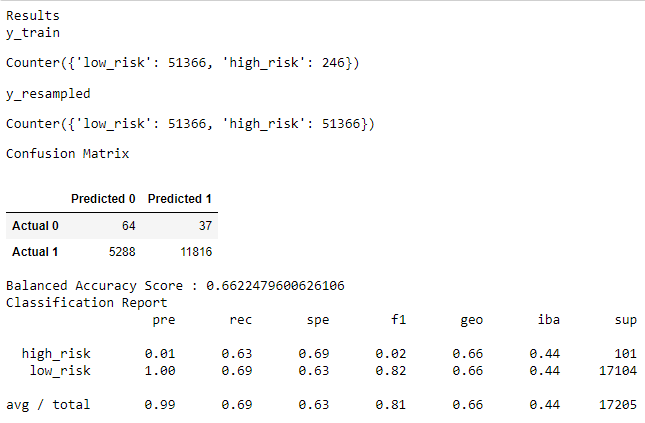
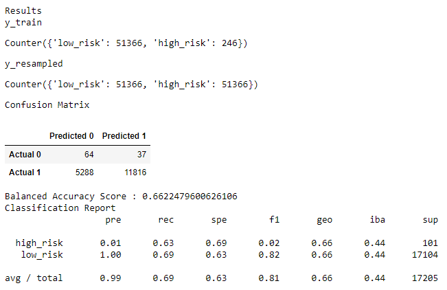
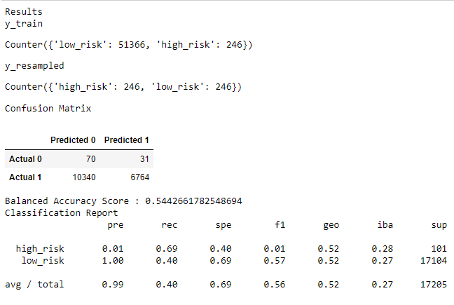
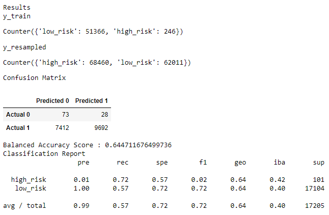
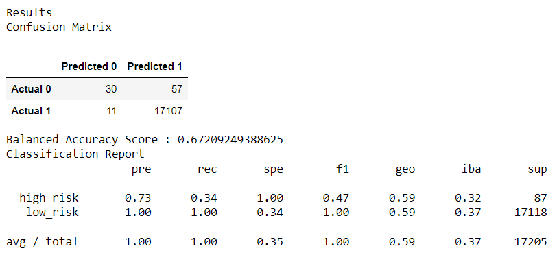
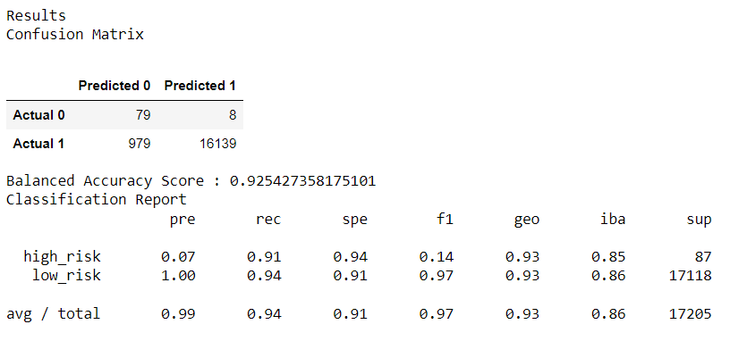

# Credit Risk Analysis

## Overview of the analysis

The purpose of this project is to analyze credit risk using imbalanced-learn and scikit-learn libraries to build and evaluate models using resampling.

Credit risk is an inherently unbalanced classification problem, as good loans easily outnumber risky loans. Therefore, I employed different techniques to train and evaluate models with unbalanced classes. 

Using the credit card credit dataset from LendingClub, a peer-to-peer lending services company, I did the following:

**I** Oversample the data using the RandomOverSampler and SMOTE algorithms, and undersample the data using the ClusterCentroids algorithm;

**II** Then, I used a combinatorial approach of over- and undersampling using the SMOTEENN algorithm;

**III** Next, I compared two new machine learning models that reduce bias, BalancedRandomForestClassifier and EasyEnsembleClassifier, to predict credit risk; and

**IV** Finally, I evaluated the performance of these models and made a written recommendation on whether they should be used to predict credit risk.

## Results

To understand the results of each model is important to consider the next concepts:

(a) Precision: is the measure of how reliable a positive classification is.

(b) Recall: is the ability of the classifier to find all the positive samples.

(c) F1 score: is a weighted average of the true positive rate (recall) and precision, where the best score is 1.0 and the worst is 0.0.

(d) Support: is the number of actual occurrences of the class in the specified dataset.

### Oversampling¶

First, I compared two oversampling algorithms to determine which algorithm results in the best performance. I oversampled the data using the naive random oversampling algorithm and the SMOTE algorithm, as follows:

`1` Naive Random Oversampling

`2` SMOTE

From the naive random oversampling algorithm and the SMOTE algorithm I got the same following results:

(a) Balanced Accuracy Score: 0.662 is less precise than expected.

(b) Precision: is 0.01 which is very low to determine the risk.

(c) Recall: is 0.63 which is low to determine the positive samples.

(d) F1 score: is 0.02 which is very close to 0.0 so it means there is no good balance between the precision and recall.

(e) Support: the are 101 actual occurrences for the high risk and 17,104 for low risk.

### Undersampling¶

Then, I tested an undersampling algorithm to determine which algorithm results in the best performance compared to the oversampling algorithms above. I used the Cluster Centroids algorithm, which returns the following results:

`3` Cluster Centroids

(a) Balanced Accuracy Score: 0.544 is low, so is not quite precise.

(b) Precision: is 0.01 which is very low to determine the risk.

(c) Recall: is 0.69 which is low to determine the positive samples.

(d) F1 score: is 0.01 which is very close to 0.0 so it means there is no good balance between the precision and recall.

(e) Support: the are 101 actual occurrences for the high risk and 17,104 for low risk.

### Combination¶

Then, I tested a combination over- and under-sampling algorithm to determine if the algorithm results in the best performance compared to the other sampling algorithms above. I used the SMOTEEN algorithm:

`4` SMOTEEN

(a) Balanced Accuracy Score: 0.644 is low, so is not quite precise.

(b) Precision: is 0.01 which is very low to determine the risk.

(c) Recall: is 0.57 which is low to determine the positive samples.

(d) F1 score: is 0.02 which is very close to 0.0 so it means there is no good balance between the precision and recall.

(e) Support: the are 101 actual occurrences for the high risk and 17,104 for low risk.

### Ensemble Learners

Finally, I compared two ensemble algorithms to determine which algorithm results in the best performance. I trained a Balanced Random Forest Classifier and an Easy Ensemble AdaBoost Classifier:

`5` Balanced Random Forest Classifier

(a) Balanced Accuracy Score: 0.672 is low, so is not quite precise.

(b) Precision: is 0.73 which is better in precision than in the other models, which means we can have many false positives.

(c) Recall: is 0.34 so it means we can have a large number of false negatives.

(d) F1 score: is 0.47 which is almost the middle, so it means the balance between the precision and recall is better in this model than in the previous.

(e) Support: the are 87 actual occurrences for the high risk and 17,118 for low risk.

`6` Easy Ensemble AdaBoost Classifier

(a) Balanced Accuracy Score: 0.925 which is the most precise of all the models.

(b) Precision: is 0.07 which means there a small number of credits considered as high risk.

(c) Recall: is 0.91 so it means we can have a small number of false negatives.

(d) F1 score: is 0.14 which is very low so it means there is huge amount of false positive.

(e) Support: the are 87 actual occurrences for the high risk and 17,118 for low risk.

## Summary 

From the results achieved, we can conclude that:

**1.** The results from the first four models are very similar, and the results of the last two have many variances, but the last one have the best balanced accuracy score.

**2.** My advice is to use the Easy Ensemble AdaBoost Classifier model because it had the best balanced accuracy score and high recall which means there is small number of false negative, even though it had a very bad precision. So taking in consideration the results, the bank analyst can deep audit certain cases to determine the individual risk.

